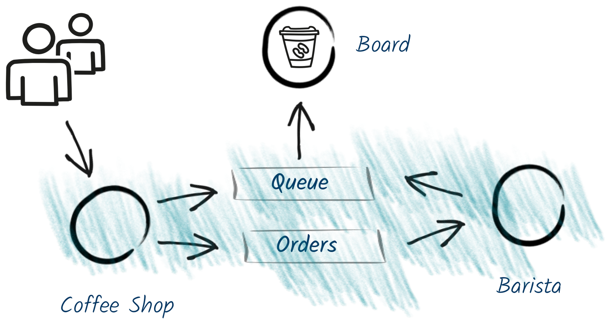

# Coffeeshop Demo with Quarkus

Reactive Event Driven Example using Kafka.

Forked from here with openshift additions

- https://github.com/cescoffier/quarkus-coffeeshop-demo

This directory contains a set of demo around _reactive_ in Quarkus with Kafka.
It demonstrates the elasticity and resilience of the system.



## Build

```bash
mvn clean package
```

## Prerequisites

Run Kafka Locally with:

```bash
docker-compose up
```

Then, create the `orders` topic with (need this for multiple partitions)

```
`./create-orders.sh`
```

On OpenShift - install the Strimzi Operator.

# Run the demo

You need to run:

* the coffee shop service
* the HTTP barista
* the Kafka barista

Im 3 terminals: 

```bash
cd coffeeshop-service
mvn compile quarkus:dev
```

```bash
cd barista-http
mvn compile quarkus:dev
```

```bash
cd barista-kafka
mvn compile quarkus:dev
```

# Execute with HTTP

The first part of the demo shows HTTP interactions:

* Barista code: `me.escoffier.quarkus.coffeeshop.BaristaResource`
* CoffeeShop code: `me.escoffier.quarkus.coffeeshop.CoffeeShopResource.http`
* Generated client: `me.escoffier.quarkus.coffeeshop.http.BaristaService`

Important points:
* Request-reply

Order coffees with:

```bash
curl -X POST -H "Content-Type: application/json" http://localhost:8080/http -d '{"product": "latte", "name": "clement"}'
curl -X POST -H "Content-Type: application/json" http://localhost:8080/http -d '{"product": "expresso", "name": "neo"}'
curl -X POST -H "Content-Type: application/json" http://localhost:8080/http -d '{"product": "mocha", "name": "flore"}'
```

Stop the HTTP Barista, you can't order coffee anymore.

# Execute with Kafka

* Barista code: `me.escoffier.quarkus.coffeeshop.KafkaBarista`: Read from `orders`, write to `queue`
* Bridge in the CoffeeShop: `me.escoffier.quarkus.coffeeshop.messaging.KafkaBaristas` just enqueue the orders in a single thread (one counter)
* Get prepared beverages on `me.escoffier.quarkus.coffeeshop.dashboard.BoardResource` and send to SSE

* Open browser to http://localhost:8080/queue
* Order coffee with:

```bash
curl -X POST -H "Content-Type: application/json" http://localhost:8080/messaging -d '{"product": "latte", "name": "clement"}'
curl -X POST -H "Content-Type: application/json" http://localhost:8080/messaging -d '{"product": "expresso", "name": "neo"}'
curl -X POST -H "Content-Type: application/json" http://localhost:8080/messaging -d '{"product": "mocha", "name": "flore"}'
```

# Baristas do breaks

Stop the Kafka barista

Continue to enqueue order

```
curl -X POST -H "Content-Type: application/json" http://localhost:8080/messaging -d '{"product": "latte", "name": "clement"}'
curl -X POST -H "Content-Type: application/json" http://localhost:8080/messaging -d '{"product": "expresso", "name": "neo"}'
curl -X POST -H "Content-Type: application/json" http://localhost:8080/messaging -d '{"product": "mocha", "name": "flore"}'
```

On the dashboard, the orders are in the "IN QUEUE" state

Restart the barista

They are processed

# 2 baristas are better

Start a second barista with: 
```bash
java -Dquarkus.http.port=9095 -Dbarista.name=tom -jar target/barista-kafka-1.0-SNAPSHOT-runner.jar
```

Order more coffee
```bash
curl -X POST -H "Content-Type: application/json" http://localhost:8080/messaging -d '{"product": "latte", "name": "clement"}'
curl -X POST -H "Content-Type: application/json" http://localhost:8080/messaging -d '{"product": "expresso", "name": "neo"}'
curl -X POST -H "Content-Type: application/json" http://localhost:8080/messaging -d '{"product": "mocha", "name": "flore"}'
```

The dashboard shows that the load is dispatched among the baristas.


## OpenShift

On OpenShift - install the Strimzi Operator
```
./create-strimzi-openshift.sh
```

Install Topics
```
./create-topics-openshift.sh
```

Create project
```
oc new-project quarkus-coffee --description "Quarkus Coffee Shop" --display-name="Quarkus Coffee Shop"
```

Build Coffee Shop

```bash
cd coffeeshop-service
mvn package -Pnative -DskipTests -Dnative-image.docker-build=true

# binary
oc new-build --binary --name=coffeeshop-service -l app=coffeeshop-service
oc start-build coffeeshop-service --from-dir=. --follow
oc new-app coffeeshop-service
oc expose svc coffeeshop-service
```

Create Barista HTTP
```bash
cd barista-http
mvn package -Pnative -DskipTests -Dnative-image.docker-build=true

# binary
oc new-build --binary --name=barista-http -l app=barista-http
oc start-build barista-http --from-dir=. --follow
oc new-app barista-http
```

Create Barista Kafka
```bash
cd barista-kafka
mvn package -Pnative -DskipTests -Dnative-image.docker-build=true

oc new-build --binary --name=barista-kafka-julie -l app=barista-kafka-julie
ln -fs Dockerfile.julie Dockerfile
oc start-build barista-kafka-julie --from-dir=. --follow
oc new-app barista-kafka-julie

oc new-build --binary --name=barista-kafka-tom -l app=barista-kafka-tom
ln -fs Dockerfile.tom Dockerfile
oc start-build barista-kafka-tom --from-dir=. --follow
oc new-app barista-kafka-tom
```

## Tekton S2I Build

Install Tekton Operator
```
./create-tekton-openshift.sh
```

Build using tekton

```
oc project quarkus-coffee
PROJECT=$(oc project -q)
oc create serviceaccount pipeline
oc adm policy add-scc-to-user privileged -z pipeline
oc adm policy add-role-to-user edit -z pipeline
--
oc apply -f ./tekton/openshift-client-task.yaml
oc apply -f ./tekton/s2i-quarkus.yaml
--
cat <<EOF | oc apply -f -
apiVersion: tekton.dev/v1alpha1
kind: Pipeline
metadata:
  name: deploy-pipeline
spec:
  resources:
  - name: app-git
    type: git
  - name: app-image
    type: image
  tasks:
  - name: build
    taskRef:
      name: s2i-quarkus
    params:
      - name: TLSVERIFY
        value: "false"
    resources:
      inputs:
      - name: source
        resource: app-git
      outputs:
      - name: image
        resource: app-image
  - name: deploy-cofeeshop-service
    taskRef:
      name: openshift-client
    runAfter:
      - build
    params:
    - name: ARGS
      value: "rollout latest dc/coffeeshop-service"
  - name: deploy-barista-kafka-julie
    taskRef:
      name: openshift-client
    runAfter:
      - build
    params:
    - name: ARGS
      value: "rollout latest dc/barista-kafka-julie"
  - name: deploy-barista-kafka-tom
    taskRef:
      name: openshift-client
    runAfter:
      - build
    params:
    - name: ARGS
      value: "rollout latest dc/barista-kafka-tom"
  - name: deploy-barista-http
    taskRef:
      name: openshift-client
    runAfter:
      - build
    params:
    - name: ARGS
      value: "rollout latest dc/barista-http"
EOF

cat <<EOF | oc apply -f -
apiVersion: tekton.dev/v1alpha1
kind: PipelineResource
metadata:
  name: quarkus-coffeeshop-git
spec:
  type: git
  params:
  - name: url
    value: https://github.com/eformat/quarkus-coffeeshop-demo.git
EOF

cat <<EOF | oc apply -f -
apiVersion: tekton.dev/v1alpha1
kind: PipelineResource
metadata:
  name: quarkus-coffeeshop-image
spec:
  type: image
  params:
  - name: url
    value: image-registry.openshift-image-registry.svc:5000/${PROJECT}/quarkus-coffeeshop-demo
EOF

-- can create multiple of these

cat <<EOF | oc create -f -
apiVersion: tekton.dev/v1alpha1
kind: PipelineRun
metadata:
  generateName: quarkus-coffeeshop-demo-deploy-pipelinerun-
spec:
  timeout: '60m'
  pipelineRef:
    name: deploy-pipeline
  trigger:
    type: manual
  serviceAccount: 'pipeline'
  resources:
  - name: app-git
    resourceRef:
      name: quarkus-coffeeshop-git
  - name: app-image
    resourceRef:
      name: quarkus-coffeeshop-image
EOF
```

#### S2I

If not using Tekton, you can use s2i

```
# s2i
oc new-build --name=quarkus-coffeeshop-demo -l app=quarkus-coffeeshop-demo quay.io/eformat/quarkus-native-s2i:graalvm-19.0.2~https://github.com/eformat/quarkus-coffeeshop-demo

# coffeeshop-service
oc new-build --name=coffeeshop-service \
    --docker-image=registry.access.redhat.com/ubi8/ubi:8.0 \
    --source-image=quarkus-coffeeshop-demo \
    --source-image-path='/home/quarkus/application-coffeeshop-service:.' \
    --dockerfile=$'FROM registry.access.redhat.com/ubi8/ubi:8.0\nCOPY application-coffeeshop-service /application\n\nEXPOSE 8080\nCMD ./application -Xmx10m -Xms10m -Xmn10m -XX:+PrintGC -XX:+VerboseGC -XX:+PrintGCTimeStamps +XX:+PrintHeapShape -Dquarkus.http.host=0.0.0.0 -Dme.escoffier.quarkus.coffeeshop.http.BaristaService/mp-rest/url=http://barista-http:8080 -Dmp.messaging.outgoing.orders.bootstrap.servers=my-cluster-kafka-bootstrap.strimzi.svc:9092 -Dmp.messaging.incoming.beverages.bootstrap.servers=my-cluster-kafka-bootstrap.strimzi.svc:9092 -Dmp.messaging.outgoing.queue.bootstrap.servers=my-cluster-kafka-bootstrap.strimzi.svc:9092' \
    --allow-missing-imagestream-tags
oc new-app --image-stream=coffeeshop-service -l app=coffeeshop-service
oc expose svc coffeeshop-service

# barista-http
oc new-build --name=barista-http \
    --docker-image=registry.access.redhat.com/ubi8/ubi:8.0 \
    --source-image=quarkus-coffeeshop-demo \
    --source-image-path='/home/quarkus/application-barista-http:.' \
    --dockerfile=$'FROM registry.access.redhat.com/ubi8/ubi:8.0\nCOPY application-barista-http /application\n\nEXPOSE 8080\nCMD ./application -Xmx10m -Xms10m -Xmn10m -XX:+PrintGC -XX:+VerboseGC -XX:+PrintGCTimeStamps +XX:+PrintHeapShape -Dquarkus.http.host=0.0.0.0 -Dquarkus.http.port=8080' \
    --allow-missing-imagestream-tags
oc new-app --image-stream=barista-http -l app=barista-http
oc expose svc barista-http

# barista-kafka-julie 
oc new-build --name=barista-kafka-julie \
    --docker-image=registry.access.redhat.com/ubi8/ubi:8.0 \
    --source-image=quarkus-coffeeshop-demo \
    --source-image-path='/home/quarkus/application-barista-kafka:.' \
    --dockerfile=$'FROM registry.access.redhat.com/ubi8/ubi:8.0\nCOPY application-barista-kafka /application\n\nEXPOSE 8080\nCMD ./application -Xmx10m -Xms10m -Xmn10m -XX:+PrintGC -XX:+VerboseGC -XX:+PrintGCTimeStamps +XX:+PrintHeapShape -Dbarista.name=julie -Dmp.messaging.incoming.orders.client.id=julie -Dmp.messaging.incoming.orders.bootstrap.servers=my-cluster-kafka-bootstrap.strimzi.svc:9092 -Dmp.messaging.outgoing.queue.bootstrap.servers=my-cluster-kafka-bootstrap.strimzi.svc:9092' \
    --allow-missing-imagestream-tags
oc new-app --image-stream=barista-kafka-julie -l app=barista-kafka-julie
oc expose svc barista-kafka-julie

# barista-kafka-tom
oc new-build --name=barista-kafka-tom \
    --docker-image=registry.access.redhat.com/ubi8/ubi:8.0 \
    --source-image=quarkus-coffeeshop-demo \
    --source-image-path='/home/quarkus/application-barista-kafka:.' \
    --dockerfile=$'FROM registry.access.redhat.com/ubi8/ubi:8.0\nCOPY application-barista-kafka /application\n\nEXPOSE 8080\nCMD ./application -Xmx10m -Xms10m -Xmn10m -XX:+PrintGC -XX:+VerboseGC -XX:+PrintGCTimeStamps +XX:+PrintHeapShape -Dbarista.name=tom -Dmp.messaging.incoming.orders.client.id=tom -Dmp.messaging.incoming.orders.bootstrap.servers=my-cluster-kafka-bootstrap.strimzi.svc:9092 -Dmp.messaging.outgoing.queue.bootstrap.servers=my-cluster-kafka-bootstrap.strimzi.svc:9092' \
    --allow-missing-imagestream-tags
oc new-app --image-stream=barista-kafka-tom -l app=barista-kafka-tom --allow-missing-imagestream-tags
oc expose svc barista-kafka-tom
```

## Test OpenShift

Tail Coffee Shop
```
oc logs $(oc get pods -l app=coffeeshop-service -o name) -f

OR

stern coffeeshop-service
```

Tail Barista HTTP
```
oc logs $(oc get pods -l app=barista-http -o name) -f

OR

stern barista-http
```

Order Coffee via synchronous  http
```
export SHOPURL=$(oc get route coffeeshop-service -n quarkus-coffee --template='{{ .spec.host }}')
./order-coffees-serial-http.sh
```

Tail Barista Kafka
```
oc logs $(oc get pods -l app=barista-kafka-julie -o name) -f

OR 

stern barista-kafka-julie

oc logs $(oc get pods -l app=barista-kafka-tom -o name) -f

OR

stern barista-kafka-tom
```

Order Coffee kafka
```
export SHOPURL=$(oc get route coffeeshop-service -n quarkus-coffee --template='{{ .spec.host }}')
./order-coffees.sh
```

Order lots more coffee

```
while true; do ./order-coffees.sh; sleep 0.5; done
```
